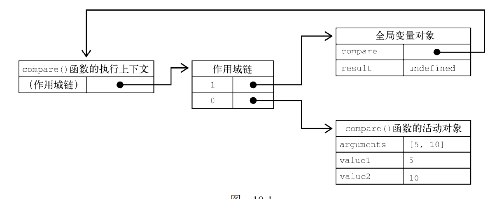
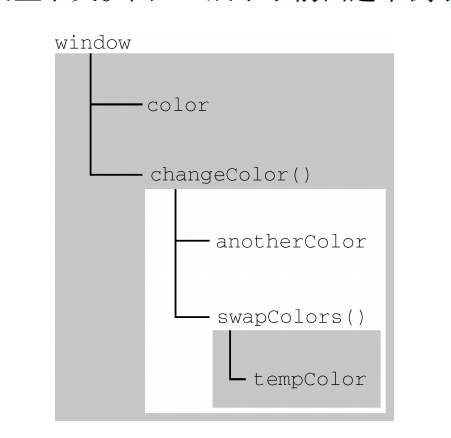

# 作用域

全局作用域，函数作用域，块级作用域

## 1.作用域链

上下文中的代码在执行的时候，会创建变量对象的一个作用域链（scope chain）。代码正在执行的上下文的变量对象始终位于作用域链的最前端。作用域链中的下一个变量对象来自包含上下文，再下一个对象来自再下一个包含上下文。以此类推直至全局上下文；全局上下文的变量对象始终是作用域链的最后一个变量对象。

> 如果上下文是函数，则其活动对象（activation object）用作变量对象。活动对象最初只有一个定义变量：arguments。（全局上下文中没有这个变量。）


```js
function compare(value1, value2) { 
 if (value1 < value2) { 
 return -1; 
 } else if (value1 > value2) { 
 return 1; 
 } else { 
 return 0; 
 } 
} 
let result = compare(5, 10);
```
> 这里定义的 compare()函数是在全局上下文中调用的。第一次调用 compare()时，会为它创建一个包含 arguments、value1 和 value2 的活动对象，这个对象是其作用域链上的第一个对象。而全局上下文的变量对象则是 compare()作用域链上的第二个对象，其中包含 this、result 和 compare。

> 函数执行时，每个执行上下文中都会有一个包含其中变量的对象。全局上下文中的叫变量对象，它会在代码执行期间始终存在。而函数局部上下文中的叫活动对象，只在函数执行期间存在。

**在定义compare()函数时，就会为它创建作用域链，预装载全局变量对象，并保存在内部的[[Scope]]中。在调用这个函数时，会创建相应的执行上下文，然后通过复制函数的[[Scope]]来创建其作用域链。接着会创建函数的活动对象（用作变量对象）并将其推入作用域链的前端。**

在这个例子中，这意味着 compare()函数执行上下文的作用域链中有两个变量对象：局部变量对象和全局变量对象。作用域链其实是一个包含指针的列表，每个指针分别指向一个变量对象，但物理上并不会包含相应的对象。



函数内部的代码在访问变量时，就会使用给定的名称从作用域链中查找变量。函数执行完毕后，局部活动对象会被销毁，内存中就只剩下全局作用域。


> 作用域链的非自己部分在函数对象被建立（函数声明、函数表达式）的时候建立，而不需要等到执行.
> 作用域链的前面部分是静态的，当函数执行时，建立一个自己当次执行的作用域，然后把这个作用域与前面共享的链关联起来;


## 2.作用域查找：

代码执行时的变量解析是沿作用域链逐级搜索变量名称完成的。搜索过程始终从作用域链的最前端开始，然后逐级往后，直到找到变量。（如果一直搜索到全局对象还没有找到变量，那么通常会报错。）


```js
let color = "blue"; 
function changeColor() { 
    let anotherColor = "red"; 
    function swapColors() { 
      let tempColor = anotherColor; 
      anotherColor = color; 
      color = tempColor; 
    // 这里可以访问 color、anotherColor 和 tempColor 
    } 
    // 这里可以访问 color 和 anotherColor，但访问不到 tempColor 
    swapColors(); 
} 
// 这里只能访问 color 
changeColor();
```


对这个例子而言，码涉及 3 个上下文：全局上下文、changeColor()的局部上下文和 swapColors()的局部上下文。
全局上下文中有一个变量 color 和一个函数 changeColor()。changeColor()的局部上下文中有一个变量 anotherColor 和一个函数 swapColors()，但在这里可以访问全局上下文中的变量 color。
swapColors()的局部上下文中有一个变量 tempColor，只能在这个上下文中访问到。全局上下文和changeColor()的局部上下文都无法访问到 tempColor。而在 swapColors()中则可以访问另外两个上下文中的变量，因为它们都是父上下文

> 内部上下文可以通过作用域链访问外部上下文中的一切，但外部上下文无法访问内部上下文中的任何东西。
> 函数参数被认为是当前上下文中的变量，因此也跟上下文中的其他变量遵循相同的访问规则。

## 3. 函数（局部变量）
```js
function foo(){
  var x= 10;
  for(var y=0;y<100;y++){
    var z =100;
  }
}

```
示例中使用了for循环，使用var声明的变量，for循环中的变量y“溢出”到函数的变量作用域中，变成函数的局部变量


## 上下文环境和作用域的关系

- 上下文环境：
可以理解为一个看不见摸不着的对象（有若干个属性），虽然看不见摸不着，但确实实实在在存在的，因为所有的变量都在里面存储着，要不然咱们定义的变量在哪里存？
另外，**对于函数来说，上下文环境是在调用时创建的**，这个很好理解。拿参数做例子，你不调用函数，我哪儿知道你要给我传什么参数？

- 作用域：
首先，它很抽象。第二，记住一句话：除了全局作用域，块级作用域，只有函数才能创建作用域。**创建一个函数就创建了一个作用域，无论你调用不调用，函数只要创建了，它就有独立的作用域，**就有自己的一个“地盘”。

- 两者关系：

一个作用域下可能包含若干个上下文环境。有可能从来没有过上下文环境（函数从来就没有被调用过）；有可能有过，现在函数被调用完毕后，上下文环境被销毁了；有可能同时存在一个或多个（闭包）。


