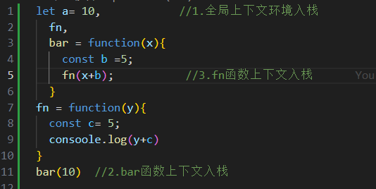
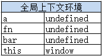
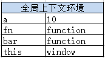

1. js的instanceof用法

instanceof 是 JavaScript 的一个运算符，用于检查一个对象是否是某个特定类的实例。

语法如下：

```js
object instanceof class
```
其中，object 是要检查的对象，class 是要检查的类或构造函数。

使用 instanceof 运算符可以判断一个对象是否是某个类的实例，或者是该类的派生类的实例。它会返回一个布尔值，表示对象是否是指定类或其派生类的实例。

下面是一个使用 instanceof 的示例：

```js
class Animal {
  constructor(name) {
    this.name = name;
  }
}

class Dog extends Animal {
  bark() {
    console.log("Woof!");
  }
}

let animal = new Animal("Animal");
let dog = new Dog("Dog");

console.log(animal instanceof Animal); // true
console.log(animal instanceof Dog);    // false
console.log(dog instanceof Animal);    // true
console.log(dog instanceof Dog);       // true
```

在上面的示例中，我们定义了一个 Animal 类和一个继承自 Animal 的 Dog 类。然后创建了一个 Animal 对象和一个 Dog 对象。通过使用 instanceof 运算符，我们可以得出以下结论：

animal instanceof Animal 返回 true，因为 animal 是 Animal 的实例。
animal instanceof Dog 返回 false，因为 animal 不是 Dog 的实例，而是 Animal 的实例。
dog instanceof Animal 返回 true，因为 dog 是 Animal 的实例，同时也是 Dog 的实例。
dog instanceof Dog 返回 true，因为 dog 是 Dog 的实例。
总结起来，instanceof 运算符可以用来判断一个对象是否是某个类的实例或其派生类的实例，从而进行类型检查或判断对象的继承关系。


2. Object.create的实现原理

Object.create() 是 JavaScript 中用于创建一个新对象的方法。它的实现原理可以简单地描述为：

- 创建一个空的构造函数（ObjectCreate）。
- 将传入的原型对象作为 ObjectCreate 的原型。
- 返回通过 new ObjectCreate() 创建的新对象。

下面是一个实现 Object.create() 的示例代码：

```js
function createObject(proto) {
  function ObjectCreate() {}
  ObjectCreate.prototype = proto;
  return new ObjectCreate();
}
// 使用示例
var obj = createObject({ foo: 'bar' });
console.log(obj.foo); // 输出 'bar'
```
在这个示例中，createObject 函数接受一个原型对象作为参数，然后创建一个空的构造函数 ObjectCreate。接下来，将原型对象赋值给 ObjectCreate 的原型属性。最后，通过使用 new ObjectCreate() 创建一个新对象，并将其返回。

请注意，这只是 Object.create() 的一种简化实现方式，实际的规范中还会考虑到更多的细节和边界情况。但是这个简化版本可以帮助你理解 Object.create() 的大致实现原理。


在不支持Object.create方法的浏览器中，则可以使用以下代码：
```js
  Object.create = Object.create || function( obj ){
      const F = function(){};
      F.prototype = obj;

      return new F();
  }
```

> 通过设置构造器的prototype来实现原型继承的时候，除了根对象Object.prototype本身之外，任何对象都会有一个原型。而通过Object.create( null )可以创建出没有原型的对象。

3. Object.getPrototypeOf

Object.getPrototypeOf是一个JavaScript内置方法，它用于获取指定对象的原型（即原型链中的上一级）。以下是它的用法：

语法：Object.getPrototypeOf(obj)

obj：要获取原型的对象。

```js
const obj = {};
const proto = { foo: 'bar' };

Object.setPrototypeOf(obj, proto);

const prototype = Object.getPrototypeOf(obj);
console.log(prototype); // 输出: { foo: 'bar' }


```

Object.getPrototypeOf方法只能获取第一个原型，无法获取整个原型链。
如果要获取完整的原型链，可以使用递归或循环来遍历对象的原型，直到获取到Object.prototype为止

```js
function getPrototypeChain(obj) {
  const prototypes = [];
  let prototype = Object.getPrototypeOf(obj);

  while (prototype !== null) {
    prototypes.push(prototype);
    prototype = Object.getPrototypeOf(prototype);
  }

  return prototypes;
}

const obj = {};
const proto1 = { foo: 'bar' };
const proto2 = { baz: 'qux' };

Object.setPrototypeOf(obj, proto1);
Object.setPrototypeOf(proto1, proto2);

const prototypeChain = getPrototypeChain(obj);
console.log(prototypeChain); // 输出: [ { baz: 'qux' }, { foo: 'bar' }, {} ]

//Object.setPrototypeOf方法将obj的原型设置为proto1。
```

在上面的示例中，我们定义了一个getPrototypeChain函数，它接受一个对象obj作为参数，并使用循环不断获取obj及其原型的原型，直到原型为null。然后，将原型对象存储在prototypes数组中，并返回该数组。最后，我们通过console.log打印出完整的原型链，输出结果为[{ baz: 'qux' }, { foo: 'bar' }, {}]。

4. new的过程

- 创建一个空对象
- 使该对象proto指向构造函数的原型对象
- 使用构造函数为其初始化属性（将构造函数的this指向新对象）
- 返回这个对象

```js
const objectFactory = function(){
  const obj = new Object();
  Constructor = [].shift.call(arguments)
  obj.__proto__ = Constructor.prototype
  const ret = Constructor.apply( obj, arguments );    // 借用外部传入的构造器给obj设置属性
  return typeof ret === 'object' ? ret : obj;     // 确保构造器总是会返回一个对象
}
  function Person( name ){
      this.name = name;
  };

  Person.prototype.getName = function(){
      return this.name;
  };
const a = objectFactory( Person, 'sven' );
  console.log( a.name );    // 输出：sven
  console.log( a.getName() );     // 输出：sven
  console.log( Object.getPrototypeOf( a ) === Person.prototype );      // 输出：true
```
5. this
JavaScript的this总是指向一个对象，而具体指向哪个对象是在运行时基于函数的执行环境动态绑定的，而非函数被声明时的环境。

this的指向大致可以分为以下4种。
 - 作为对象的方法调用。
 - 作为普通函数调用。
 - 构造器调用。
 - Function.prototype.call或Function.prototype.apply调用。

1．作为对象的方法调用
当函数作为对象的方法被调用时，this指向该对象：

```js
  const obj = {
      a: 1,
      getA: function(){
        alert ( this === obj );    // 输出：true
        alert ( this.a );    // 输出： 1
      }
  };
  obj.getA();
```
2．作为普通函数调用

此时的this总是指向全局对象。在浏览器的JavaScript里，这个全局对象是window对象。
```js
  window.name = 'globalName';
  const getName = function(){
      return this.name;
  };
  console.log( getName() );    // 输出：globalName
```

<!-- 或者 -->

```js
  window.name = 'globalName';

  const myObject = {
      name: 'sven',
      getName: function(){
        return this.name;
      }
  };

  const getName = myObject.getName;
  console.log( getName() );    // globalName
```

3．构造器调用
构造器的外表跟普通函数一模一样，它们的区别在于被调用的方式。
> 当用new运算符调用函数时，该函数总会返回一个对象，通常情况下，构造器里的this就指向返回的这个对象

```js
const MyClass = function(){
    this.name = 'sven';
};
const obj = new MyClass();
alert ( obj.name );     // 输出：sven
```
> 但用new调用构造器时，还要注意一个问题，如果构造器显式地返回了一个object类型的对象，那么此次运算结果最终会返回这个对象，而不是我们之前期待的this：

```js
const MyClass = function(){
  this.name = 'sven'
  return {
    name:"anne"
  }
}
const obj = new MyClass();
console.log(obj.name)  //anne
```
> 如果构造器不显式地返回任何数据，或者是返回一个非对象类型的数据，就不会造成上述问题：
```js
const MyClass = function(){
  this.name = 'sven'
  return "anne"
}
const obj = new MyClass();
console.log(obj.name)  //sven
```
4. Function.prototype.call或Function.prototype.apply调用

> 跟普通的函数调用相比，用Function.prototype.call或Function.prototype.apply可以动态地改变传入函数的this：

```js
  const obj1 = {
      name: 'sven',
      getName: function(){
        return this.name;
      }
  };

  const obj2 = {
      name: 'anne'
  };

  console.log( obj1.getName() );     // 输出： sven
  console.log( obj1.getName.call( obj2 ) );    // 输出：anne
```

6. call和apply


(1)call和apply的区别

> apply接受两个参数，第一个参数指定了函数体内this对象的指向，第二个参数为一个带下标的集合，这个集合可以为数组，也可以为类数组，apply方法把这个集合中的元素作为参数传递给被调用的函数：
```js
  const func = function( a, b, c ){
      alert ( [ a, b, c ] );    // 输出 [ 1, 2, 3 ]
  };
  func.apply( null, [ 1, 2, 3 ] );
//在这段代码中，参数1、2、3被放在数组中一起传入func函数，它们分别对应func参数列表中的a、b、c。
```
> call传入的参数数量不固定，跟apply相同的是，第一个参数也是代表函数体内的this指向，从第二个参数开始往后，每个参数被依次传入函数：

```js
const func = function( a, b, c ){
    alert ( [ a, b, c ] );    // 输出 [ 1, 2, 3 ]
};
func.call( null, 1, 2, 3 );
```
> 当使用call或者apply的时候，如果我们传入的第一个参数为null，函数体内的this会指向默认的宿主对象，在浏览器中则是window：

有时候我们使用call或者apply的目的不在于指定this指向，而是另有用途，比如借用其他对象的方法。那么我们可以传入null来代替某个具体的对象：

```js
Math.max.apply( null, [ 1, 2, 5, 3, 4 ] )    // 输出：5
```
(2) call和apply的用途

- 改变this指向
call和apply最常见的用途是改变函数内部的this指向

```js
  const obj1 = {
      name: 'sven'
  };

  const obj2 = {
      name: 'anne'
  };

  window.name = 'window';

  const getName = function(){
      alert ( this.name );
  };

  getName();    // 输出： window
  getName.call( obj1 );    // 输出： sven
  getName.call( obj2 );    // 输出： anne
  // 当执行getName.call( obj1 )这句代码时，getName函数体内的this就指向obj1对象
```

- Function.prototype.bind

**模拟bind**

```js
Function.prototype.bind = function(context){
  return ()=>{
    return this.apply(context,arguments)
  }
}

const obj = {
  name:'sven'
}
const func = function(){
  console.log(this.name)
}.bind(obj)

func()
```
> 在Function.prototype.bind的内部实现中，我们先把func函数的引用保存起来，然后返回一个新的函数。当我们在将来执行func函数时，实际上先执行的是这个刚刚返回的新函数。在新函数内部，self.apply( context, arguments )这句代码才是执行原来的func函数，并且指定context对象为func函数体内的this。

**复杂版**

```js
Function.prototype.bind = function(){
  const self = this,
  context = [].shift.call( arguments ), //需要绑定的this上下文
  args = [].slice.call( arguments ); //剩余参数转换成数组
  // console.log(arguments,'==args')
  return function(){
      //执行新的函数的时候，会把之前传入的context当作新函数体内的this,并且组合两次分别传入的参数，作为新函数的参数
      return self.apply( context, [].concat.call( args, [].slice.call( arguments ) ) );
  }
}
const obj = {
name:'sven'
}

const func = function( a, b, c, d ){
  console.log ( this.name );        // 输出：sven
  console.log ( [ a, b, c, d ] )    // 输出：[ 1, 2, 3, 4 ]
}.bind( obj, 1, 2 );

func(3,4)

```
- 借用其他对象的方法

(1)借用构造函数

```js
  const A = function( name ){
      this.name = name;
  };

  const B = function(){
      A.apply( this, arguments );
  };

  B.prototype.getName = function(){
      return this.name;
  };

  const b = new B( 'sven' );
  console.log( b.getName() );  // 输出： 'sven'
```
(2)函数的参数列表arguments是一个类数组对象，虽然它也有“下标”，但它并非真正的数组，所以也不能像数组一样，进行排序操作或者往集合里添加一个新的元素。

这种情况下，我们常常会借用Array.prototype对象上的方法。比如想往arguments中添加一个新的元素，通常会借用Array.prototype.push：

```js
  (function(){
      Array.prototype.push.call( arguments, 3 );
      console.log ( arguments );    // 输出[1,2,3]
  })( 1, 2 );
```
> 想把arguments转成真正的数组的时候，可以借用Array.prototype.slice方法；想截去arguments列表中的头一个元素时，又可以借用Array.prototype.shift方法

借用Array.prototype.push方法的对象还要满足以下两个条件

  (1)对象本身要可以存取属性；

  (2)对象的length属性可读写。

如果借用Array.prototype.push方法的不是一个object类型的数据，而是一个number类型的数据呢？我们无法在number身上存取其他数据

```js
  const a = 1;
  Array.prototype.push.call( a, 'first' );
  alert ( a.length );      // 输出：undefined
  alert ( a[ 0 ] );    // 输出：undefined
```
函数的length属性就是一个只读的属性，表示形参的个数，我们尝试把一个函数当作this传入Array.prototype.push：

```js
const func = function(){};
Array.prototype.push.call( func, 'first' );

alert ( func.length );
// 报错：cannot assign to read only property ‘length' of function(){}
```

7. 闭包
- 变量类型

- 变量声明

    - 1. 使用 var 的函数作用域声明
   > 在使用 var 声明变量时，变量会被自动添加到最接近的上下文。在函数中，最接近的上下文就是函数的局部上下文。在 with 语句中，最接近的上下文也是函数上下文。如果变量未经声明就被初始化了，那么它就会自动被添加到全局上下文

变量提升：var 声明会被拿到函数或全局作用域的顶部，位于作用域中所有代码之前。这个现象叫作“提升”（hoisting）。

```js
//通过在声明之前打印变量，可以验证变量会被提升。声明的提升意味着会输出 undefined 而不是Reference Error：
console.log(name); // undefined 
var name = 'Jake'; 
function() { 
 console.log(name); // undefined 
 var name = 'Jake'; 
}
```
  - 2. 使用 let 的块级作用域声明

(1)S6 新增的 let 关键字跟 var 很相似，但它的作用域是块级的，这也是 JavaScript 中的新概念。块级作用域由最近的一对包含花括号{}界定。换句话说，if 块、while 块、function 块，甚至连单独的块也是 let 声明变量的作用域

```js
if (true) { 
 let a; 
} 
console.log(a); // ReferenceError: a 没有定义
while (true) { 
 let b; 
}
console.log(b); // ReferenceError: b 没有定义
function foo() { 
 let c; 
} 
console.log(c); // ReferenceError: c 没有定义
 // 这没什么可奇怪的
 // var 声明也会导致报错
// 这不是对象字面量，而是一个独立的块
// JavaScript 解释器会根据其中内容识别出它来
{ 
 let d; 
} 
console.log(d); // ReferenceError: d 没有定义
```
(2)let 与 var 的另一个不同之处是在同一作用域内不能声明两次。重复的 var 声明会被忽略，而重复的 let 声明会抛出 SyntaxError。
```js
var a; 
var a; 
// 不会报错
{ 
 let b; 
 let b; 
} 
// SyntaxError: 标识符 b 已经声明过了
```


let 的行为非常适合在循环中声明迭代变量。使用 var 声明的迭代变量会泄漏到循环外部，这种情况应该避免。来看下面两个例子：
```js
for (var i = 0; i < 10; ++i) {} 
console.log(i); // 10 
for (let j = 0; j < 10; ++j) {} 
console.log(j); // ReferenceError: j 没有定义
```
严格来讲，let 在 JavaScript 运行时中也会被提升，但由于“暂时性死区”（temporal dead zone）的缘故，实际上不能在声明之前使用 let 变量。因此，从写 JavaScript 代码的角度说，let 的提升跟 var是不一样的。

(3)使用 const 的常量声明

  除了 let，ES6 同时还增加了 const 关键字。使用 const 声明的变量必须同时初始化为某个值。一经声明，在其生命周期的任何时候都不能再重新赋予新值

```js
const a; // SyntaxError: 常量声明时没有初始化
const b = 3; 
console.log(b); // 3 
b = 4; // TypeError: 给常量赋值
```
const 除了要遵循以上规则，其他方面与 let 声明是一样的：

  const 声明只应用到顶级原语或者对象。换句话说，赋值为对象的 const 变量不能再被重新赋值为其他引用值，但对象的键则不受限制。

  ```js
  const o1 = {}; 
  o1 = {}; // TypeError: 给常量赋值
  const o2 = {}; 
  o2.name = 'Jake'; 
  console.log(o2.name); // 'Jake'
  ```


- 执行上下文

执行全局代码时，全局上下文会被推入一个上下文栈，每次调用函数，函数的上下文也会被推到上下文栈。在函数执行完之后，函数上下文出栈，并且被销毁，再重新回到全局上下文环境。处于活动状态的执行上下文环境只有一个。


根据以下代码介绍上下文的入栈和出栈



在执行代码时，全局上下文会被推入一个上下文栈。每个上下文都有一个关联的变量对象（variable object），而这个上下文中定义的所有变量和函数都存在于这个对象上。




然后是代码执行。代码执行到第11行之前，上下文环境中的变量都在执行过程中被赋值。




执行到第11行，调用bar函数，将bar函数执行上下文环境压栈，设置为活动状态。


执行到第5行，又调用了fn函数。将bfn函数函数执行上下文环境压栈，设置为活动状态。


待第5行执行完毕，即fn函数执行完毕后，fn函数上下文环境出栈，并且被销毁（已经用完了，就要及时销毁，释放内存）。


同理，待第13行执行完毕，即bar函数执行完毕后，bar函数上下文环境出栈，并且被销毁。


拓展知识：
> 每个上下文都有一个关联的变量对象（variable object），而这个上下文中定义的所有变量和函数都存在于这个对象上。

> 全局上下文是最外层的上下文。根据 ECMAScript 实现的宿主环境，表示全局上下文的对象可能不一样。在浏览器中，全局上下文就是我们常说的 window 对象，因此所有通过 var 定义的全局变量和函数都会成为 window 对象的属性和方法。使用 let 和 const 的顶级声明不会定义在全局上下文中，但在作用域链解析上效果是一样的。

> 上下文在其所有代码都执行完毕后会被销毁，包括定义在它上面的所有变量和函数（全局上下文在应用程序退出前才会被销毁，比如关闭网页或退出浏览器）。

> 每个函数调用都有自己的上下文。当代码执行流进入函数时，函数的上下文被推到一个上下文栈上。
在函数执行完之后，上下文栈会弹出该函数上下文，将控制权返还给之前的执行上下文。ECMAScript程序的执行流就是通过这个上下文栈进行控制的。

- 作用域

上下文中的代码在执行的时候，会创建变量对象的一个作用域链（scope chain）。代码正在执行的上下文的变量对象始终位于作用域
链的最前端。作用域链中的下一个变量对象来自包含上下文，再下一个对象来自再下一个包含上下文。以此类推直至全局上下文；全局上下文的变量对象始终
是作用域链的最后一个变量对象。

> 如果上下文是函数，则其活动对象（activation object）用作变量对象。活动对象最初只有一个定义变量：arguments。（全局上下文中没有这个变量。）

代码执行时的变量解析是沿作用域链逐级搜索变量名称完成的。搜索过程始终从作用域链的最前端开始，然后逐级往后，直到找到变量。（如果没有找到变量，那么通常会报错。）

```js
let color = "blue"; 
function changeColor() { 
    let anotherColor = "red"; 
    function swapColors() { 
      let tempColor = anotherColor; 
      anotherColor = color; 
      color = tempColor; 
    // 这里可以访问 color、anotherColor 和 tempColor 
    } 
    // 这里可以访问 color 和 anotherColor，但访问不到 tempColor 
    swapColors(); 
} 
// 这里只能访问 color 
changeColor();
```
对这个例子而言，码涉及 3 个上下文：全局上下文、changeColor()的局部上下文和 swapColors()的局部上下文。
全局上下文中有一个变量 color 和一个函数 changeColor()。changeColor()的局部上下文中有一个变量 anotherColor 和一个函数 swapColors()，但在这里可以访问全局上下文中的变量 color。
swapColors()的局部上下文中有一个变量 tempColor，只能在这个上下文中访问到。全局上下文和changeColor()的局部上下文都无法访问到 tempColor。而在 swapColors()中则可以访问另外两个上下文中的变量，因为它们都是父上下文

> 内部上下文可以通过作用域链访问外部上下文中的一切，但外部上下文无法访问内部上下文中的任何东西。
> 函数参数被认为是当前上下文中的变量，因此也跟上下文中的其他变量遵循相同的访问规则。


- 自由变量
- 自执行函数
- 垃圾回收机制


