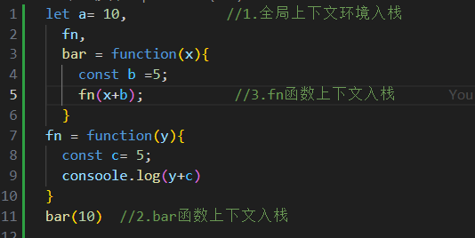
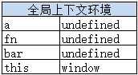
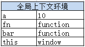
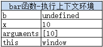

# 执行上下文

执行全局代码时，全局上下文会被推入一个上下文栈，每次调用函数，函数的上下文也会被推到上下文栈。在函数执行完之后，函数上下文出栈，并且被销毁，再重新回到全局上下文环境。处于活动状态的执行上下文环境只有一个。

> 执行上下文分全局上下文、函数上下文和块级上下文
> 对于函数来说，上下文环境是在调用时创建的

根据以下代码介绍上下文的入栈和出栈

在执行代码时，全局上下文会被推入一个上下文栈。每个上下文都有一个关联的变量对象（variable object），而这个上下文中定义的所有变量和函数都存在于这个对象上。

然后是代码执行。代码执行到第11行之前，上下文环境中的变量都在执行过程中被赋值。

执行到第11行，调用bar函数，将bar函数执行上下文环境压栈，设置为活动状态。

执行到第5行，又调用了fn函数。将bfn函数函数执行上下文环境压栈，设置为活动状态。

待第5行执行完毕，即fn函数执行完毕后，fn函数上下文环境出栈，并且被销毁（已经用完了，就要及时销毁，释放内存）。

同理，待第13行执行完毕，即bar函数执行完毕后，bar函数上下文环境出栈，并且被销毁。

拓展知识：
> 每个上下文都有一个关联的变量对象（variable object），而这个上下文中定义的所有变量和函数都存在于这个对象上。

> 全局上下文是最外层的上下文。根据 ECMAScript 实现的宿主环境，表示全局上下文的对象可能不一样。在浏览器中，全局上下文就是我们常说的 window 对象，因此所有通过 var 定义的全局变量和函数都会成为 window 对象的属性和方法。使用 let 和 const 的顶级声明不会定义在全局上下文中，但在作用域链解析上效果是一样的。

> 上下文在其所有代码都执行完毕后会被销毁，包括定义在它上面的所有变量和函数（全局上下文在应用程序退出前才会被销毁，比如关闭网页或退出浏览器）。

> 变量或函数的上下文决定了它们可以访问哪些数据，以及它们的行为。

> 每个函数调用都有自己的上下文。当代码执行流进入函数时，函数的上下文被推到一个上下文栈上。
在函数执行完之后，上下文栈会弹出该函数上下文，将控制权返还给之前的执行上下文。ECMAScript程序的执行流就是通过这个上下文栈进行控制的。

