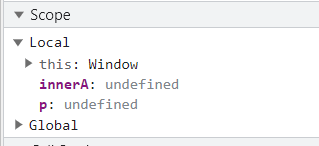
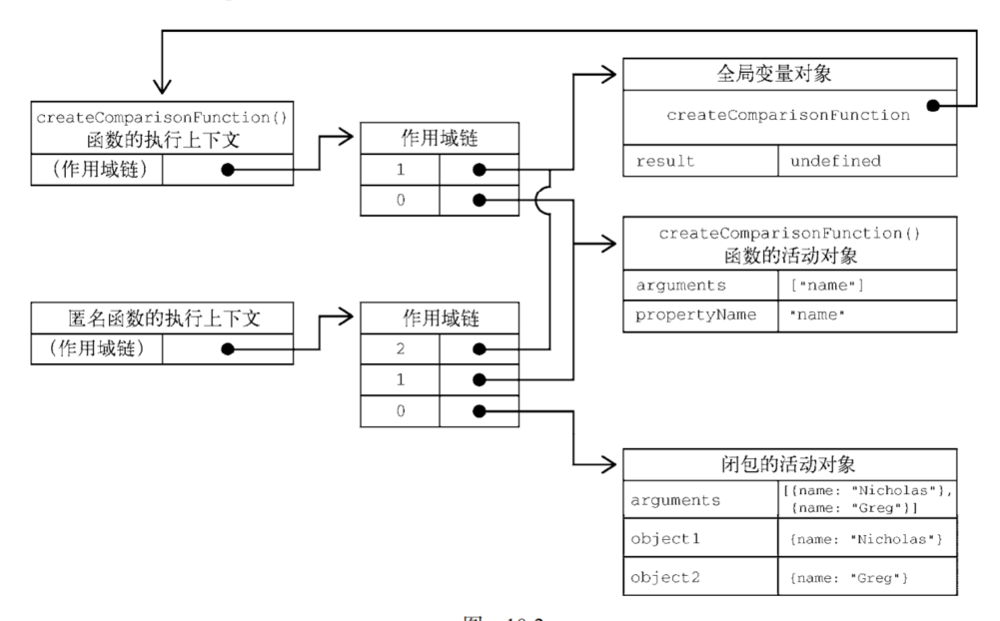

# 闭包

要了解闭包需要先了解以下几个知识点：

1. this对象
2. 执行上下文
3. 作用域
4. 垃圾回收机制（内存泄漏）


## 定义：

比较常见的闭包是指在函数外部可以访问函数内部变量的函数，因为一般情况下在函数外部是没法访问函数内部的变量的。比如说定义一个函数fn1，如果在函数fn1的内部再定义一个函数fn2，fn2是能访问到fn1的变量的，然后再把fn2 return出去，fn1外部就可以通过fn2访问fn1的变量了；

> 闭包指的是那些引用了另一个函数作用域中变量的函数，通常是在嵌套函数中实现的。

- 内部函数实用了外部函数的变量
- 外部函数已经退出
- 内部函数可以访问

```js
function fn1（）{
	const a = 1
	function fn2(){
    console.log(a)
  }
  return fn2
}
const fn = fn1()//fn=>fn2
fn()//1
```

> 函数内部的代码在访问变量时，就会使用给定的名称从作用域链中查找变量。函数执行完毕后，局部活动对象会被销毁，内存中就只剩下全局作用域。不过，闭包就不一样了。

```js
function a() {
  //外部闭包域 ,一个名为 a 的 Function 对象
  let p = 0; //私有变量 p
  let innerA = function () {
    //内部闭包域 ,一个名为 innerA 的 Function 对象
    console.log(p); //对外部闭包域的私有变量进行了引用,故 innerA 对象的 function scope 会产生一个名为 closure 的对象属性,closure 对象内含有一个名为 p 的引用
  };
  innerA(); //输出0
  p++;
  innerA(); //输出1
}
a();

```
结果如下:


第一次调用innerA

第二次调用 innerA

控制台输出

## 为什么fn2是能访问到fn1的变量的？

在一个函数内部定义的函数会把其包含函数的活动对象添加到自己的作用域链中。

因此，在createComparisonFunction()函数中，匿名函数的作用域链中实际上包含 createComparisonFunction()的活动对象。如下图展示了以下代码执行后的结果。



> 在 createComparisonFunction()返回匿名函数后，它的作用域链被初始化为包含 createComparisonFunction()的活动对象和全局变量对象。这样，匿名函数就可以访问到 createComparisonFunction()可以访问的所有变量。另一个有意思的副作用就是，createComparisonFunction()的活动对象并不能在它执行完毕后销毁，**因为匿名函数的作用域链中仍然有对它的引用。**在 createComparisonFunction()执行完毕后，其执行上下文的作用域链会销毁，但它的活动对象仍然会保留在内存中，直到匿名函数被销毁后才会被销毁：


## 常见闭包的类型：

1. 函数作为返回值

```js
function fn(){
  const max = 10;
  return function bar(x){
    if(x > max){
      console.log(x)
    }
  }
}
const f1 = fn()
const max = 100;
f1(15)
// bar函数作为返回值，赋值给f1变量。执行f1(15)时，用到了fn作用域下的max变量的值。
```

2. 函数作为参数传递

```js
const max =10
const fn = function(x){
  if(x > max){
    console.log(x)
  }
}
function fn3(f){
  const max = 100;
  f(15)
}
fn3(fn)

```
如上代码中，fn函数作为一个参数被传递进入另一个函数，赋值给f参数。执行f(15)时，max变量的取值是10，而不是100。

查找f函数沿着作用域链查找，发现f->fn,fn是全局作用域的函数，则max取的10，15>10,返回15


## 如何释放内存

匿名函数被销毁后才会被销毁

```js
// 创建比较函数
let compareNames = createComparisonFunction('name'); 
// 调用函数
let result = compareNames({ name: 'Nicholas' }, { name: 'Matt' }); 
// 解除对函数的引用，这样就可以释放内存了
compareNames = null; 
```

这里，创建的比较函数被保存在变量 compareNames 中。把 compareNames 设置为等于 null 会解除对函数的引用，从而让垃圾回收程序可以将内存释放掉。作用域链也会被销毁，其他作用域（除全局作用域之外）也可以销毁。

## 经典闭包案例

1.用9种办法解决js闭包经典面试题之for循环取i

假设页面上有5个div节点，我们通过循环来给每个div绑定onclick事件，按照索引顺序，点击第1个div时弹出0，点击第2个div时弹出1，以此类推。

```html
<html>
    <body>
      <div>1</div>
      <div>2</div>
      <div>3</div>
      <div>4</div>
      <div>5</div>
    <script>

      var nodes = document.getElementsByTagName( 'div' );
      for ( var i = 0, len = nodes.length; i < len; i++ ){
          nodes[ i ].onclick = function(){
              alert ( i );
          }
      };

    </script>
    </body>
</html>
```

> 测试这段代码就会发现，无论点击哪个div，最后弹出的结果都是5。这是因为div节点的onclick事件是被异步触发的，当事件被触发的时候，for循环早已结束，此时变量i的值已经是5，所以在div的onclick事件函数中顺着作用域链从内到外查找变量i时，查找到的值总是5。


解决办法1：
> 解决思路:增加若干个对应的闭包域空间(这里采用的是匿名函数),专门用来存储原先需要引用的内容(下标),不过只限于基本类型(基本类型值传递,对象类型引用传递)

解决方法是在闭包的帮助下，把每次循环的i值都封闭起来。当在事件函数中顺着作用域链中从内到外查找变量i时，会先找到被封闭在闭包环境中的i，如果有5个div，这里的i就分别是0,1,2,3,4：

```js
   //声明一个匿名函数,若传进来的是基本类型则为值传递,故不会对实参产生影响,
   //该函数对象有一个本地私有变量arg(形参) ,该函数的 function scope 的 closure 对象属性有两个引用,一个是 arr,一个是 i
   //尽管引用 i 的值随外部改变 ,但本地私有变量(形参) arg 不会受影响,其值在一开始被调用的时候就决定了.
var nodes = document.getElementsByTagName( 'div' );
for ( var i = 0, len = nodes.length; i < len; i++ ){
    (function( arg ){
      nodes[ i ].onclick = function(){  //onclick函数实例的 function scope 的 closure 对象属性有一个引用 arg,
          console.log(arg);   //只要 外部空间的 arg 不变,这里的引用值当然不会改变
      }
    })( i )   //立刻执行该匿名函数,传递下标 i(实参)
};
```
解决办法2:

> 解决思路:将下标作为对象属性(name:"i",value:i的值)添加到每个数组项(p对象)中


```js
var nodes = document.getElementsByTagName( 'div' );
for ( var i = 0, len = nodes.length; i < len; i++ ){
    //为当前数组项即当前 p 对象添加一个名为 i 的属性,值为循环体的 i 变量的值,
    //此时当前 p 对象的 i 属性并不是对循环体的 i 变量的引用,而是一个独立p 对象的属性,属性值在声明的时候就确定了
    //(基本类型的值都是存在栈中的,当有一个基本类型变量声明其等于另一个基本变量时,此时并不是两个基本类型变量都指向一个值,而是各自有各自的值,但值是相等的)
   nodes[i].i = i;
   nodes[i].onclick = function () {
        alert(this.i);
    }
}
```
解决办法3:
解决思路:
   与解决办法一有点相似但却有点不太相似.
   相似点:同样是增加若干个对应的闭包域空间用来存储下标
   不同点:解决办法1是在新增的匿名闭包空间内完成事件的绑定,而此例是将事件绑定在新增的匿名函数返回的函数上
   此时绑定的函数中的 function scope 中的 closure 对象的 引用 arg 是指向将其返回的匿名函数的私有变量 arg
> 

```js
var nodes = document.getElementsByTagName( 'div' );
for ( var i = 0, len = nodes.length; i < len; i++ ){
   nodes[i].onclick = (function(arg){
        return function () {
            alert(arg);
        }
    })(i);
}
```
解决办法4:

```js
var nodes = document.getElementsByTagName( 'div' );
for ( var i = 0, len = nodes.length; i < len; i++ ){
  (function () {
    var temp = i;
    nodes[i].onclick = function () {
      alert(temp);
    };
  })();
}
```

解决办法5:

```js
/*
解决思路与解决办法三及四相同
 */
var nodes = document.getElementsByTagName( 'div' );
for ( var i = 0, len = nodes.length; i < len; i++ ){
   nodes[i].onclick = (function () {
        var temp = i;
        return function () {
            alert(temp);
        }
    })();
}
```
解决办法6：

> 解决思路:将下标添加为绑定函数的属性

```js
var nodes = document.getElementsByTagName( 'div' );
for ( var i = 0, len = nodes.length; i < len; i++ ){
   (nodes[i].onclick = function(){
    alert((arguments.callee.i))   //arguments 参数对象  arguments.callee 参数对象所属函数
   }).i = i
}
```
解决办法7：

> 解决思路: 通过 new 使用 Function 的构造函数 创建 Function 实例实现,由于传入的函数体的内容是字符串,故 Function 得到的是一个字符串拷贝,
而没有得到 i 的引用(这里是先获取 i.toString()然后与前后字符串拼接成一个新的字符串,Function 对其进行反向解析成 JS 代码)

```js
var nodes = document.getElementsByTagName( 'div' );
for ( var i = 0, len = nodes.length; i < len; i++ ){
   nodes[i].onclick = new Function("alert("+i+");");//每 new 一个 Function 得到一个 Function 对象(一个函数),有自己的闭包域
}
```
解决办法8:

解决思路:直接通过 Function 返回一个函数
与解决办法7的不同之处在于:
- 解决办法7使用 new,使用了 new,此时 Function 函数就被当成构造器可以用来构造一个 Function 实例返回
- 当前解决办法没有使用 new ,即将 Function 函数当成一个函数,传入参数返回一个新函数;
- 其实此处 new 与不 new 只是的区别在于:
  - 使用了 new 即 Function 函数充当构造器,由 JS 解析器生产一个新的对象,构造器内的 this 指向该新对象;
  - 不实用 new 即 Function 函数依旧是函数,由函数内部自己生产一个实例返回.

```js
var nodes = document.getElementsByTagName( 'div' );
for ( var i = 0, len = nodes.length; i < len; i++ ){
   nodes[i].onclick = Function("alert("+i+");");
}
```

解决办法9:
 
>解决思路: 使用ES6新语法 let 关键字

```js
 let nodes = document.getElementsByTagName( 'div' );
  for ( let i = 0, len = nodes.length; i < len; i++ ){
      nodes[ i ].onclick = function(){
          alert ( i );
      }
  };

```

2. 封装变量

> 闭包可以帮助把一些不需要暴露在全局的变量封装成“私有变量”

```js
  let cache = {};

  let mult = function(){
      let args = Array.prototype.join.call( arguments, ', ' );
      if ( cache[ args ] ){
        return cache[ args ];
      }
      let a = 1;
      for ( let i = 0, l = arguments.length; i < l; i++ ){
          a = a * arguments[i];
      }

      return cache[ args ] = a;
  };

  alert ( mult( 1,2,3 ) );     // 输出：6
  alert ( mult( 1,2,3 ) );     // 输出：6
```
> mult函数接受一些number类型的参数，并返回这些参数的乘积。现在我们觉得对于那些相同的参数来说，每次都进行计算是一种浪费，我们可以加入缓存机制来提高这个函数的性能。

我们看到cache这个变量仅仅在mult函数中被使用，与其让cache变量跟mult函数一起平行地暴露在全局作用域下，不如把它封闭在mult函数内部，这样可以减少页面中的全局变量，以避免这个变量在其他地方被不小心修改而引发错误。代码如下：

```js
let mult = (function(){
  let cache = {};
  return function(){
    const args = Array.prototype.join.call( arguments, ', ' );  //1, 2, 3
    if ( cache[ args ] ){
      return cache[ args ];
    }
    let a = 1;
    for ( let i = 0, l = arguments.length; i < l; i++ ){
        a = a * arguments[i];
    }
    return cache[ args ] = a;
  }
})()
console.log ( mult( 1,2,3 ) );     // 输出：6
console.log ( mult( 1,2,3 ) );     // 输出：6
```

> 提炼函数是代码重构中的一种常见技巧。如果在一个大函数中有一些代码块能够独立出来，我们常常把这些代码块封装在独立的小函数里面。

```js

let mult = (function(){
  let cache = {};
  const calculate = function(){
    let a = 1;
    for ( let i = 0, l = arguments.length; i < l; i++ ){
        a = a * arguments[i];
    }
    return a
  }
  return function(){
    const args = Array.prototype.join.call( arguments, ', ' );  //1, 2, 3
    if ( cache[ args ] ){
      return cache[ args ];
    }
    return cache[ args ] = calculate.apply(null,arguments);
  }
})()
console.log ( mult( 1,2,3 ) );     // 输出：6
console.log ( mult( 1,2,3 ) );     // 输出：6
```

3. 延续局部变量的寿命


2. 

```js
function  fn1() {
  let num = 1;
  return function () {
      /*fn1=>num*/
      num++;
      console.log(num)
  }
}
let fn2 = fn1(); 
fn2();//2
fn2();//3

let fn3 = fn1();
fn3()//2
```

3. 

```js
const a=10;
function fx(){
  const b=20;
    function bar(){
        console.log((a+b));
    }
    return bar;
}
const x=fx();
b=200;
x(); //30
```

4. num是全局变量

```js
let num = 1;
function  fn1() {
    num = 5;
    return function () {
      console.log(num);
      num++
    }
}

let fn2 =fn1();
num = 2;  
fn2()   //2

```