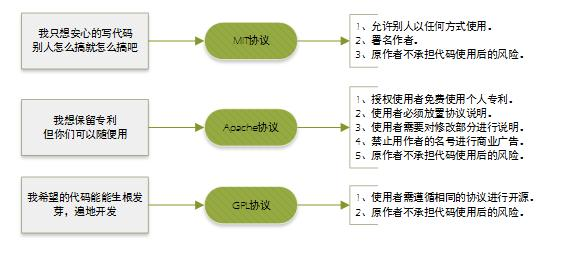

# 深入浅出 package.json

> npm是前端开发人员广泛使用的包管理工具，项目中通过package.json来管理项目中所依赖的npm包的配置。package.json就是一个json文件，除了能够描述项目的包依赖外，允许我们使用“语义化版本规则”指明你项目依赖包的版本，让你的构建更好地与其他开发者分享，便于重复使用。

> 项目的 package.json 是配置和描述如何与程序交互和运行的中心。 npm CLI（和 yarn）用它来识别你的项目并了解如何处理项目的依赖关系。package.json 文件使 npm 可以启动你的项目、运行脚本、安装依赖项、发布到 NPM 注册表以及许多其他有用的任务。 npm CLI 也是管理 package.json 的最佳方法，因为它有助于在项目的整个生命周期内生成和更新 package.json 文件。


## 1. package.json

### 1.1 package.json简介

在nodejs项目中，package.json是管理其依赖的配置文件，通常我们在初始化一个nodejs项目的时候会通过：

```bash
npm init
```
然后在你的目录下会生成3个目录/文件， node_modules, package.json和 package.lock.json。其中package.json的内容为：

```json
{
    "name": "Your project name",
    "version": "1.0.0",
    "description": "Your project description",
    "main": "app.js",
    "scripts": {
        "test": "echo \"Error: no test specified\" && exit 1",
    },
    "author": "Author name",
    "license": "ISC",
    "dependencies": {
        "dependency1": "^1.4.0",
        "dependency2": "^1.5.2"
    }
}
```
> 上述可以看出，package.json中包含了项目本身的元数据,以及项目的子依赖信息(比如dependicies等)。


###  1.2 package-lock.json

我们发现在npm init的时候，不仅生成了package.json文件，还生成了package-lock.json文件。那么为什么存在package.json的清空下，还需要生成package-lock.json文件呢。本质上package-lock.json文件是为了锁版本，在package.json中指定的子npm包比如：react: "^16.0.0"，在实际安装中，只要高于react的版本都满足package.json的要求。这样就使得根据同一个package.json文件，两次安装的子依赖版本不能保证一致。
而package-lock文件如下所示，子依赖dependency1就详细的指定了其版本。起到lock版本的作用。

```
{
    "name": "Your project name",
    "version": "1.0.0",
    "lockfileVersion": 1,
    "requires": true,
    "dependencies": {
        "dependency1": {
            "version": "1.4.0",
            "resolved": 
"https://registry.npmjs.org/dependency1/-/dependency1-1.4.0.tgz",
            "integrity": 
"sha512-a+UqTh4kgZg/SlGvfbzDHpgRu7AAQOmmqRHJnxhRZICKFUT91brVhNNt58CMWU9PsBbv3PDCZUHbVxuDiH2mtA=="
        },
        "dependency2": {
            "version": "1.5.2",
            "resolved": 
"https://registry.npmjs.org/dependency2/-/dependency2-1.5.2.tgz",
            "integrity": 
"sha512-WOn21V8AhyE1QqVfPIVxe3tupJacq1xGkPTB4iagT6o+P2cAgEOOwIxMftr4+ZCTI6d551ij9j61DFr0nsP2uQ=="
        }
    }
}

```

## 2.package.json常用属性

### 2.1 name：包名

 name 规范

- 最好取简短而语义化的值
- 不能以,.开头
- 不能有大写字母/空格/下滑线!
- 不能和 NPM 网站中已有的包名字重名！

### 2.2 version：版本号

version 具体体现为：:“x.y.z”

修复 bug,小改动，增加 z
增加了新特性，但仍能向后兼容，增加 y
有很大的改动，无法向后兼容,增加 x
```
使用 npm version <update_type>自动升级版本号
update_type为patch, minor, major其中之一，分别表示补丁，小改，大改

npm version patch
npm version minor
npm version major
```

### 2.3 description 一个描述，方便别人了解你的模块作用，搜索的时候也有用。

```json
{
  "description": "xxxx"
}
```
### 2.4 private

如果为 true，则该程序包被视为私有程序,Yarn/NPM 会在任何情况下均拒绝发布该程序包。这防止私人存储库意外发布
```json
{
  "private": true
}
```

### 2.5 keywords 一个字符串数组，方便别人搜索到本模块

```json
{
  "keywords": [
    "ant",
    "component",
    "design"
  ]
}
```
> 当我们使用 npm 检索模块时，会对模块中的 description 字段和 keywords 字段进行匹配，写好 package.json 中的 description 和 keywords 将有利于增加我们模块的曝光率。

### 2.6 homepage

项目主页 url,默认值为/

一般来说，我们打包的静态资源会部署在 CDN 上，为了让我们的应用知道去哪里加载资源，则需要我们设置一个根路径，这时可以通过 package.json 中的 homepage 字段设置应用的根路径。

```json
{
  "homepage": "https://ant.design"
}
```
### 2.7 bugs
填写一个 bug 提交地址或者一个邮箱，被你的模块坑到的人可以通过这里吐槽，例如：
```json
{
  "bugs": {
    "url":"https://github.com/ant-design/ant-design/issues"
  }
}
```

### 2.8 license

你应该为你的开源代码模块制定一个开源协议，让用户知道他们有何权限来使用你的模块，以及使用该模块有哪些限制
  - MIT 是最少约束的选择。
  - GPL 是最多约束的。
如果是个人随意作品，建议 MIT 许可。如果是公司或者需要严格保护的开源产品，GPL。

```json
{
  "license": "MIT"
}
```




### 2.9 和用户相关的属性: author, contributors

```json
{
  "author": "iikonan",
  "contributors": [
    "zhangsan",
    "lisi"
  ]
}
```

### 2.10 script

- scripts
该字段用于列出在运行 yarn run 时将要执行的小型 shell 脚本。
请注意，包含:（冒号）的脚本是项目的全局变量，无论你当前的工作空间如何，都可以调用它们。

> 请注意，脚本总是相对于最近的工作空间（而不是 cwd）执行。

```js
"scripts": {
  "test": "jest",
  "build:dev": "webpack-cli --config ./webpack.dev.config.js",
  "build:test": "webpack-cli --config ./webpack.test.config.js",
  "build:pro": "webpack-cli --config ./webpack.pro.config.js"
}
```

**NPM 脚本的原理**

npm 脚本的原理非常简单。每当执行 npm run，就会自动新建一个 Shell，在这个 Shell 里面执行指定的脚本命令。因此，只要是 Shell（一般是 Bash）可以运行的命令，就可以写在 npm 脚本里面。

比较特别的是，npm run 新建的这个 Shell，会将当前目录的 node_modules/.bin 子目录加入 PATH 变量，执行结束后，再将 PATH 变量恢复原样。

这意味着，当前目录的 node_modules/.bin 子目录里面的所有脚本，都可以直接用脚本名调用，而不必加上路径。比如，当前项目的依赖里面有 Mocha，只要直接写 mocha test 就可以了。

```json
"test": "mocha test"
```
而不用写成下面这样:
```json
"test": "./node_modules/.bin/mocha test"
```
> 由于 npm 脚本的唯一要求就是可以在 Shell 执行，因此它不一定是 Node 脚本，任何可执行文件都可以写在里面。
> npm 脚本的退出码，也遵守 Shell 脚本规则。如果退出码不是0，npm 就认为这个脚本执行失败。

### 2.11 bin

> 用于将某些可执行 Javascript 文件公开给父包的字段。 此处列出的所有条目都可以通过$ PATH 获得。通俗点理解就是我们全局安装， 我们就可以在命令行中执行这个文件， 本地安装我们可以在当前工程目录的命令行中执行该文件。

- bin属性用来将可执行文件加载到全局环境中，指定了bin字段的npm包，一旦在全局安装，就会被加载到全局环境中，可以通过别名来执行该文件。

```json
"bin": {
  "my-bin": "./dist/my-bin.js",
}
```
dist/my-bin.js
```js
#!/usr/bin/env node

console.log("cool");
```
> 一旦在全局安装，就会被加载到全局环境中，可以通过别名来执行该文件。 
```bash
my-bin -v
```
> 如果非全局安装，那么会自动连接到项目的node_module/.bin目录中。与前面介绍的script标签中所说的一致，可以直接用别名来使用。


### 2.12 workspaces


工作区是 monorepos 用来将一个大型项目拆分为半独立子项目的一项可选功能，每个子项目都列出了自己的一组依赖关系。 工作区字段是全局模式列表，这些模式与应成为应用程序工作区的所有目录匹配。

早期我们会用yarn workspaces，现在npm官方也支持了workspaces,workspaces解决了本地文件系统中如何在一个顶层root package下管理多个子packages的问题，在workspaces声明目录下的package会软链到最上层root package的node_modules中。

```json
{
  "name": "my-project",
  "workspaces": [
    "packages/a"
  ]
}
```
在一个npm包名为my-project的npm包中，存在workspaces配置的目录。
并且该最上层的名为my-project的root包，有packages/a子包。此时，我们如果npm install,那么在root package中node_modules中安装的npm包a，指向的是本地的package/a.

```
.
+-- node_modules
|  `-- packages/a -> ../packages/a
+-- package-lock.json
+-- package.json
`-- packages
   +-- a
   |   `-- package.json
```
-- packages/a -> ../packages/a 指的就是从node_modules中a链接到本地npm包的软链

## 3.不常用属性

### 3.1funding 在开源领域，资金是一个长期存在的问题

funding命令的作用是让维护 npm 的开发人员(为 Node.js 创建包)声明元数据，为有意愿的捐赠者指明捐赠平台。

在 package.json 文件中添加了一个funding 字段， 可指向在线捐赠服务的 url，如 Patreon、Open Collective、GitHub Sponsors、License Zero 或者其他支付网站。

```json
{
  "funding": {
    "type": "opencollective",
    "url": "https://opencollective.com/ant-design"
  }
}
```
## 4.环境相关属性

### 4.1 type

> js的模块化规范包含了commonjs、CMD、UMD、AMD和ES module等，最早先在node中支持的仅仅是commonjs字段，但是从node13.2.0开始后，node正式支持了ES module规范，在package.json中可以通过type字段来声明npm包遵循的模块化规范。


可能的值
  - commonjs(默认值),适用于 Node.js 环境(服务端)
  - module,即 ES Module 语法,适用于浏览器环境(客户端)
```json
  {
  "type": "commonjs"
  }
```
需要注意的是：

  - 不指定type的时候，type的默认值是commonjs，不过建议npm包都指定一下type

  - 当type字段指定值为module则采用ESModule规范

  - 当type字段指定时，目录下的所有.js后缀结尾的文件，都遵循type所指定的模块化规范

  - 除了type可以指定模块化规范外，通过文件的后缀来指定文件所遵循的模块化规范，以.mjs结尾的文件就是使用的ESModule规范，以.cjs结尾的遵循的是commonjs规范`

- main

package.json 里的 main字段，它可以用来指定加载的入口文件，通常情况下它都是指向 commonjs 模块入口，要使用 ES Module 的 Tree Shaking 功能，就需要增加一个字段 module，指向 esmodule 模块入口

```json
  "main": "lib/index.js",
  "module": "es/index.mjs",
```
> 假如你的项目是一个 npm 包，当用户安装你的包后，require('my-module') 返回的是 main 字段中所列出文件的 module.exports 属性。

当不指定main 字段时，默认值是模块根目录下面的 index.js 文件。

- module
> 最早先在node中支持的仅仅是commonjs字段，但是从node13.2.0开始后，node正式支持了ES module规范，
与 ES6 兼容的环境尝试通过其名称访问程序包时将使用的路径。
module 字段用于指向 ES 版本的库/包,一般指定为 webpack/rollup 打包 ES 版本后的路径
```json
{
  "module": "es/index.js"
}

```
- exports

我们看到 package.json 里除了 main 和 module，还有一个 exports 字段,由于 exports 字段只有支持 ES6 的 Node.js 才认识，所以需要用 main 来兼容旧版本的 Node.js。

```json
 "exports": {
    ".": {
      "require": "./lib/index.js",
      "import": "./es/index.mjs"
    },
    "./es": "./es/index.mjs",
    "./lib": "./lib/index.js",
    "./es/*.mjs": "./es/*.mjs",
    "./es/*": "./es/*.mjs",
    "./lib/*.js": "./lib/*.js",
    "./lib/*": "./lib/*.js",
    "./*": "./*"
  },
```

exports 字段有多种用法：

1. exports 字段的别名如果是.，就代表模块的主入口，优先级高于 main 字段，利用.这个别名，可以为 ES6 模块和 CommonJS 指定不同的入口。

```
 ".": {
      "require": "./lib/index.js",
      "import": "./es/index.mjs"
    },
```
上面代码中，别名.的 require 条件指定 require()命令的入口文件（即 CommonJS 的入口），import 条件指定其他情况的入口（即 ES6 的入口）。

2. 子目录别名

```json
 "./es": "./es/index.mjs",
  "./lib": "./lib/index.js",
  "./es/*.mjs": "./es/*.mjs",
  "./es/*": "./es/*.mjs",
  "./lib/*.js": "./lib/*.js",
  "./lib/*": "./lib/*.js",
  "./*": "./*"
```

上面的代码指定./es/index.mjs 别名为./es，然后就可以从别名加载这个文件。

```js
//如：
import { ElButton } from "element-plus/es";
// 加载 ./node_modules/element-plus/es/index.mjs
```
- browserslist

> 指定该模板供浏览器使用的版本。Browserify 这样的浏览器打包工具，通过它就知道该打包那个文件。

```json
{
  "browserslist": [
    "> 0.5%",
    "last 2 versions",
    "Firefox ESR",
    "not dead",
    "IE 11",
    "not IE 10"
  ]
}

```


## 发布相关的属性

- files 描述了将软件包作为依赖项安装时要包括的条目，默认值为[“*”]，这意味着它将包括所有文件。

当你发布package时，具体那些文件会发布上去

```json
{
  "files": ["dist/**/*", "lib/**/*"]
}
```
你还可以在包的根目录或子目录中提供.npmignore 文件，以防止某些文件被发布。

.npmignore 文件的工作原理与.gitignore 一样。
如果存在.gitignore 文件，而缺少.npmignore，则将改用.gitignore 的内容。
files字段内容会覆盖.npmignore 和.gitignore的内容。


